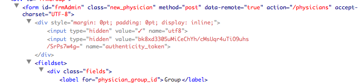
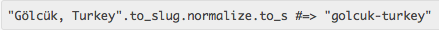
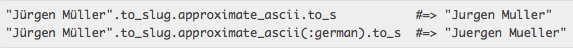

!SLIDE 
# What I love about Rails3
## Josh Software
## @gautamrege

!SLIDE center
# Application suddenly crashed

!SLIDE center
# Who? Me?

!SLIDE 
# System Upgraded libraries
## compatibilty break
## cross library issues

!SLIDE
# How are library versions managed?
## Java
## PHP
## .NET 

!SLIDE center

!SLIDE 
# Using bundler

    @@@ruby
    source "http://rubygems.org"
    gem "nokogiri"
    gem "rack", "~>1.1"

!SLIDE
# Using bundler

    @@@ruby
    group :test do
      gem "rspec", :require => "spec"
    end

    gem "nokogiri", :git => 
        "git://github.com/tenderlove/nokogiri.git"

    gem "splat", :path => "~/Code/splat"

!SLIDE center
# Unobtrusive Javascript in Rails (UJS)

!SLIDE bullets
# Ever wanted to ...

* avoid submit if button clicked twice!
* make non-get requests from Hyperlinks!
* submit form data via Ajax

!SLIDE bullets 
# UJS way

* :remote => true 
* live JQuery function binding

!SLIDE center
# XSS (Cross Site Scripting)

!SLIDE bullets
# CSRF token

* Automatically generated in forms
* csrf_meta_tag 
* authenticity_token in all Forms

!SLIDE center
# The Authenticity token

!SLIDE 
# SQL-injection

    @@@ruby
    # Wrong
    where("user_name = '#{user_name}' AND "
          "password = '#{password}'").first

    # Correct
    where("user_name = ? AND password = ?", 
          user_name, password).first

    # Correct and clean
    where(:user_name => user_name, 
          :password => password).first

!SLIDE bullets
# default HTML safety

    @@@ruby
    <%= "" %>

!SLIDE
# N+1 query problem

    @@@ruby
    clients = Client.all.limit(10)
   
    clients.each do |client|
      puts client.address.postcode
    end

    # 11 queries!

!SLIDE
# Eager loading in Rails
    @@@ruby
    clients = Client.includes(:address).limit(10)
   
    clients.each do |client|
      puts client.address.postcode
    end

    # 2 queries

!SLIDE center
# Transliteration 
## ActiveRecord / Babosa

 

!SLIDE bullets
# Rails caching performance 
# Identity_map

* in-memory cache 
* prevents duplicate retrieval of same object data
* context of the same request or thread
* memory consumption reduction

!SLIDE bullets
# Rails concurrency robustness
# Optimisitic Locking

* 2 HTTP request manipulate same data!
* add a lock_version column!
* StaleObjectError

!SLIDE 
# "Java is scalable and reliable"
# What the ....
## What does that even mean??

!SLIDE
#Thank You
## Powered by Showoff
